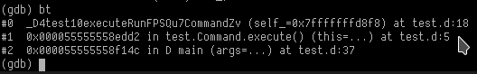
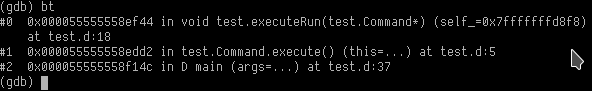

# GDB Ddemangle

Helps to demangle traceback debugging an application that is written in D.

## Requirements

* Python 3.5 or above ([How to check](#check-python-version))
* Installed [ddemangle](https://github.com/dlang/tools/blob/master/ddemangle.d) avaialable at PATH variable

## Installation

* `mkdir ~/.gdb/ && cd ~/.gdb`
* `git clone https://github.com/ANtlord/gdb-ddemangle`
* Create a file `.gdbinit` if it doesn't exist yet
* Add `source .gdb/gdb-ddemangle/ddemangle.py`. 

Hint: you can also use [gdb-colour-filter](https://github.com/daskol/gdb-colour-filter)

## Check Python version

* Run `gdb`
* Run `python print(sys.version)` in GDB

## Result

### Before

### After

